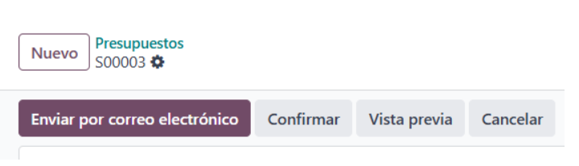
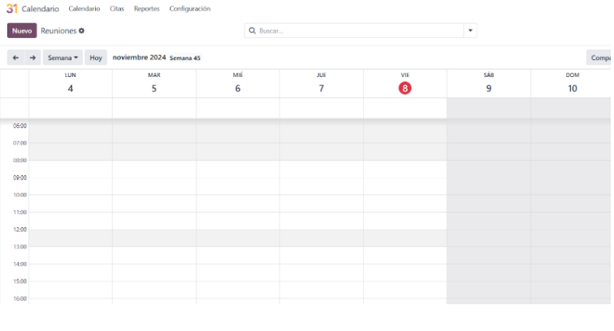
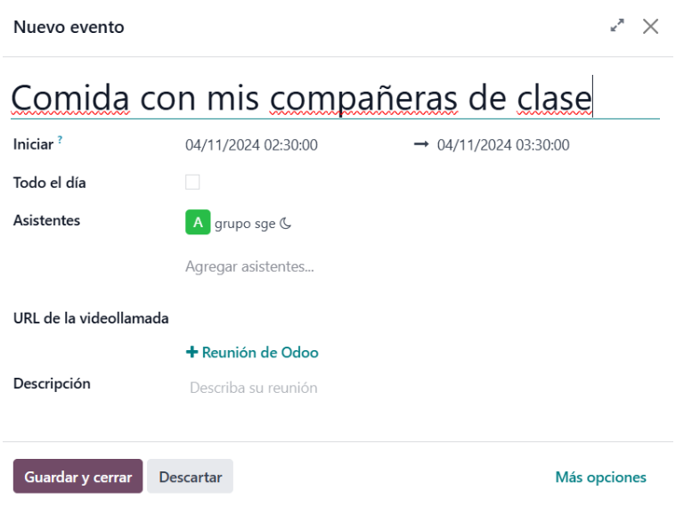

# INTRODUCCIÓ

Som una empresa consultora que ven els serveis d'Odoo a petites i mitjanes empreses.

### Punts Claus per a la Venda d’un ERP a un Client Potencial

Considerem que els punts claus a l'hora de vendre un ERP són els següents: 
- Aconseguir l'optimització dels processos.
- Millora de la visibilitat i presa de decisions de l'empresa del nostre client.
- Millora de l'experiència del client per tal de poder anticipar-nos a les seves necessitats.
- Possibilitat de personalització pel nostre client i escalabilitat.
- Adaptació a la normativa.

#  EL NOSTRE CLIENT: RESTAURANT THE BEAR

Els mòduls següents són els que hem ofert al nostre client amb una explicació detallada del funcionament de cadascú.
# Vendes

A l’apartat de **Vendes** gestionem les demandes en línia.

A vendes, tenim les seccions de **comandes de venda** i **pressupostos**, on es defineixen:

- **Client**
- **Direcció de facturació**
- **Direcció d’entrega**
- **Data de venciment**
- **Llista de preus** (si en tenim)
- **Condicions de pagament** (com pagament immediat o a un termini de dies)

Després, afegim els productes per fer el pressupost.

### Mètodes d’Enviament

Definim un **mètode d’enviament** especificant el mètode i el pes de l’ordre.

### Confirmació del Pressupost

Un cop creat el pressupost, el podem confirmar i enviar al client per correu electrònic.

## Punt de Venda

En aquest mòdul es troben els aplicatius necessaris per a la gestió econòmica dels diferents punts de venda, des de la taula de productes i preus fins a la gestió de comandes de les taules i el cobrament posterior.

### Taulell Principal

El taulell principal ofereix el control d’obertura de la caixa registradora, incloent dades sobre el total de diners en data de tancament.

### Creació de Factura

Després, crearem una **factura** a partir del pressupost. Podem escollir entre:

- Factura regular
- Factura anticipada per percentatge
- Factura anticipada per import fix

Quan la factura està creada, el client només ha de fer el pagament amb el mètode escollit. Si hi ha algun error a la factura, es pot fer una **factura rectificativa** indicant el motiu o crear-ne una de nova.

### Objectius de Facturació i Guanys

En aquest apartat, definim els **objectius de facturació** i les **guanys**. Podem visualitzar gràfics de vendes i el rendiment dels equips de vendes en quioscs, punts de venda, etc.

### Clients

Aquí trobem una llista de tots els **clients** que han fet alguna comanda.

### Facturació Pendent

A la **secció de facturació** es gestionen les factures pendents d’emetre.

### Productes

Aquest apartat mostra la **disponibilitat de productes** en el restaurant.

#### Variants de Producte

Podem crear variants de producte, definir el tipus (servei, bé o producte del restaurant) i especificar polítiques de facturació basades en quantitats sol·licitades o entregades. També es poden definir proveïdors i afegir vendes addicionals.

#### Reposició de Productes

Es pot reposar un producte, indicant la quantitat, la data programada i el proveïdor definit prèviament.

#### Llista de Productes

Podem organitzar una llista de productes per categories (entregues, despeses, etc.) i definir preus, descomptes o fórmules per a cada producte.

### Informes

Aquí es mostren **gràfics analítics** de vendes, per comercials i de productes i clients.

### Configuració

A **configuració**, es poden afegir mètodes de pagament i fer altres ajustaments al sistema.

---

# Calendari

La secció de **Calendari** permet programar cites, com reserves de taula, videotrucades, etc. Aquí es visualitza el calendari i es poden crear cites en hores específiques.

### Cites

Per a cada cita, podem triar el tipus de servei (reserva de taula, recurs, videotrucada), definir la durada, la finestra de disponibilitat, la data límit de cancel·lació i l’usuari o recurs assignat.

**Opcions addicionals:**

- Configurar correus de cancel·lació i confirmació
- Configurar pagaments per avançat
- Preferències alimentàries, si s’escau

### Compartició de Cites

Es pot compartir la cita per a qualsevol usuari, només per a nosaltres o per a usuaris i recursos específics.

### Reserves de Clients

Amb els paràmetres establerts, es poden registrar reserves de clients amb nom, assistents, data i durada.

### Modificació de l’Estat de la Cita

És possible modificar l’estat de la cita (reservat, cancel·lat, no mostrar).

### Dates de Tancament

Es poden afegir dates de tancament de recursos per motius especials.

### Programació

A **programació** visualitzem les reserves de recursos i de personal per cobrir els dies de treball.

#### Reserva de Recursos

#### Reserva de Personal

### Informes

A l’apartat d’**informes** es poden consultar anàlisis detallats sobre gestió de temps, cites i disponibilitat en el sistema. Aquests informes ajuden a monitoritzar la productivitat, amb filtres per durada i nombre de cites, i les dades es poden exportar a fulls de càlcul.

### Configuració

A configuració, es defineixen:

- Recordatoris per correu o SMS
- Recursos addicionals
- Estat de recursos (pausats i els seus motius)
- Invitacions per a propostes de cites

## Punt de Venda

En aquest mòdul es troben els aplicatius necessaris per a la gestió econòmica dels diferents punts de venda, des de la taula de productes i preus fins a la gestió de comandes de les taules i el cobrament posterior.

### Taulell Principal

El taulell principal ofereix el control d’obertura de la caixa registradora, incloent dades sobre el total de diners en data de tancament.

## Planificació

El mòdul de planificació d’Odoo és una eina dins de l'ERP que ajuda les empreses a gestionar i planificar les tasques i els recursos de manera eficient. És especialment útil per organitzar l'assignació de treball en equips, optimitzant la disponibilitat dels recursos i facilitant una planificació precisa de projectes, activitats i esdeveniments.

### Funcions Clau

- **Planificació i assignació de recursos:** Permet assignar recursos (com persones, equips o materials) a projectes o tasques específiques, facilitant la visualització de la càrrega de treball i assegurant que cada membre de l’equip sàpiga què ha de fer i quan.

