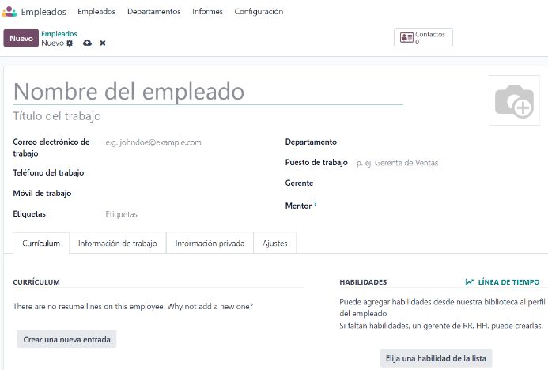
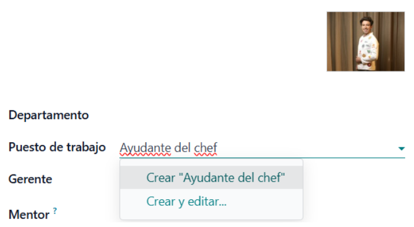
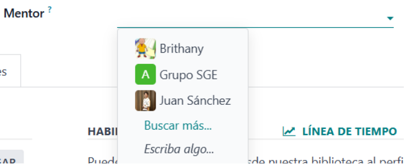
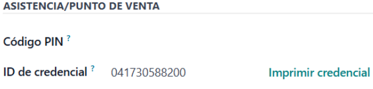
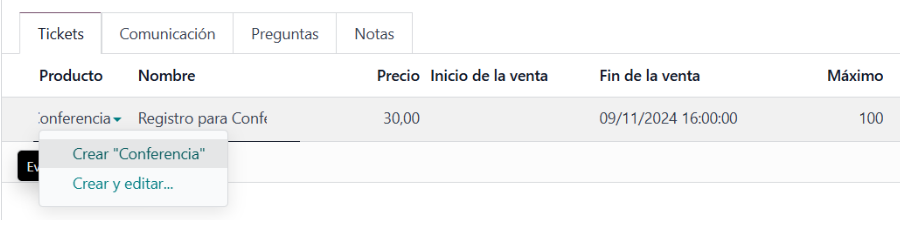
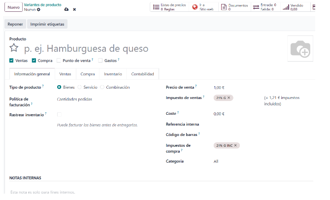

# INTRODUCCIÓ

Som una empresa consultora que ven els serveis d'Odoo a petites i mitjanes empreses.

### Punts Claus per a la Venda d’un ERP a un Client Potencial

Considerem que els punts claus a l'hora de vendre un ERP són els següents: 
- Aconseguir l'optimització dels processos.
- Millora de la visibilitat i presa de decisions de l'empresa del nostre client.
- Millora de l'experiència del client per tal de poder anticipar-nos a les seves necessitats.
- Possibilitat de personalització pel nostre client i escalabilitat.
- Adaptació a la normativa.

#  EL NOSTRE CLIENT: RESTAURANT THE BEAR

Els mòduls següents són els que hem ofert al nostre client amb una explicació detallada del funcionament de cadascú.

## Llicències que ofereix Odoo

| Llicència | Característiques | Empreses | Preu |
|-----------|-----------|-----------|-----------|
| Gratuïta  | Tot i ser gratuïta, aquesta llicència només ofereix funcionalitats bàsiques de l'ERP. No inclou moltes de les eines avançades ni actualitzacions.  | Empreses petites i proves.  | gratuït  |
| Estàndard  | Funcions més completes, suport i actualitzacions regulars, aplicacions i mòduls, com ara comptabilitat, gestió d'inventaris, CRM, projectes, màrqueting, vendes, etc.  | Empreses mitjanes que requereixen un ERP robust.  |11,90 €/usuari/mes |
| Personalitzada  | Personalització molt detallada, consultoria i suport especialitzat, desenvolupament de mòduls específics.  | Empreses grans o amb necessitats específiques.  | 17,90 €/usuari/mes

  
## 1. Empleats
En aquest apartat podem categoritzar els empleats, departaments, informes i configuració
de Empleats, podem veure el personal que tenim i els detalls de cadascun de ells:

L'àrea de Departament que s'encarrega de tasques particulars, el que permet una major eficiència a la gestió podem crear uno nou en el que podem agregar un nom, gerent, departament pare y el seu color.

Els informes tenim el registre de certificacions obtinguts per els empleats i la visualització de certificats del empleats, classificats per àrees (tècniques, idiomes, etc.).

Per poder crear un nou empleat desde Empleats fem click el botó “nou”, apareixerà un nou formulari de empleat. Completem la informació necessària i qualsevol detall adicional. 

Camps necessaris:
Nom dels empleats, títol del treball, correu electrònic, telèfon i mòbil del treball. 

Podem agregar un departament nou al que perteneix, si no hem creat desde l’apartat Departaments i agregar una fotografía del treballador:

A continuació, podem afegir el lloc de treball que ocupa un empleat dins de l'organització.

Podem agregar un Mentor que serà una persona amb experiència i coneixements que guia i dona suport a un altre empleat que tinguem afegit.

A l'apartat de Currículum podrem crear línies de currículum. Després d'afegir una entrada, en el botó 'afegir' proporcionarem la informació de l'empleat per a cada entrada.

Per afegir una habilitat apareixerà el formulari 'Trieu una habilitat de la llista'. Introduïu la informació de l'empleat per a cada habilitat:

A Informació de treball podem col·locar la ubicació, adreça, si tenim o no aprovadors que serveixen per a definir quines sol·licituds de despesa necessiten aprovació abans de ser processades i les seves despeses

Col·locarem també en l'Horari les hores laborables, la zona horària i la Planificació que tindrà rols i rols per defecte. Podem crear un nou des de 'Crear' en rols:

A Informació privada podem col·locar les dades personals de cada empleat, com el contacte privat, la nacionalitat, el contacte d'emergència, l'educació, la situació familiar i els permisos de treball si és estranger.

Dins d'Ajustos podrem col·locar el tipus d'empleat, l'usuari relacionat que podrem crear a 'crear usuari' i el cost per hora.

Assistències/Punt de venda si l'empleat té o necessita un codi NIP o un ID de credencial, pot introduir-los aquí. Feu clic a 'Generar' al costat de l'ID de credencial per crear-ne un. El codi NIP s'utilitza per iniciar i tancar sessió al quiosc de l'aplicació Assistència i en un sistema PdV si en tenim un.

## Reclutament
Podem afegir un nou lloc de treball.

Un cop afegit el lloc de treball, podem fer la configuració de les postulacions per al lloc:

Podem afegir un candidat, qualificació inicial, primera entrevista, segona entrevista i la proposta de treball.

## 2. Esdeveniments
Per crear un esdeveniment, fem clic a "Nou" des del tauler d'Esdeveniments. Odoo ens dirigirà a la pàgina d'un formulari en blanc de plantilla d'esdeveniment on omplirem les dades corresponents.

**Límit de registres**

El límit de registres, quan està activat, limita els registres d'assistents a una quantitat determinada.

**Entrades**

A la pestanya Entrades, podrem afegir línies per indicar cada tipus d'entrada que oferirem. També podrem definir el preu, les dates d'inici i fi, i el nombre màxim d'entrades a la venda.

Si no s'habilita la venda d'entrades, es mostrarà un botó de registre de manera predeterminada a la pàgina de l'esdeveniment.

**Comunicació**

A la pestanya Comunicació, podem configurar els correus electrònics i els missatges. Fem clic a "Afegir una línia" i, després, triem (o creem) una plantilla de comunicació amb el menú desplegable de la columna Plantilla.

Ara cal definir l'Interval i la Unitat de temps per establir cada quant s'ha d'enviar la comunicació. També existeix l'opció d'enviar aquestes comunicacions de manera immediata mitjançant algun activador específic.

**Qüestionaris**

Enviar qüestionaris durant els registres és una bona manera d'avaluar les necessitats i els interessos dels assistents abans de l'esdeveniment. També serveix com a eina d'anàlisi informativa per informar abans o després dels esdeveniments.

Per crear un qüestionari des de l'aplicació Esdeveniments i a la pestanya Preguntes, podem afegir una línia per definir si és obligatòria, el tipus de pregunta i l'ordre.
 

**Notes**

Si anem a la pestanya Notes, allà trobarem les opcions per afegir notes o instruccions per a les entrades. També podrem deixar notes internes (per exemple, llistes de coses per fer, informació de contacte, etc.).

**Estat de l'esdeveniment**

Un cop creat l'esdeveniment, podem establir l'estat com a Nou, Reservat, Anunciat, Cancel·lat o Finalitzat.

## 1.Vendes

Les vendes son on gestionem les demandes onlines.

En vendes tenim l’apartat de comandes de venda i pressupostos, on posarem el client, direcció de factura, direcció de entrega y la data de venciment, si tenim alguna llista de preus la podem posar, també les condicions de pagament en les que definim per exemple si volem un pagament immediat, o de un límit de dies. Seguidament posem els productes per fer el pressupost

Agregarem un mètode d’enviament on definirem el mètode i el pes de la ordre

Una vegada fet el pressupost ho podem confirmar y també enviar-li per correu electrònic

Ara seguidament d’això, crearem una factura d’aquest pressupost. Podem escollir si volem una factura regular, una anticipada per percentatge o bé una anticipada per import fix. 

## 7. Punt de Venda

En aquest mòdul es troben els aplicatius necessaris per a la gestió econòmica dels diferents punts de venda, des de la taula de productes i preus fins a la gestió de comandes de les taules i el cobrament posterior.

### Taulell Principal

El taulell principal ofereix el control d’obertura de la caixa registradora, incloent dades sobre el total de diners en data de tancament.

### Comandes

Permet dur a terme un control de les diverses comandes fetes in situ i del total d’aquestes, a més de gestionar els tipus de pagament emprats i la finestra de preparació per a la cuina. Això permet una Integració i sincronització amb altres mòduls:
- **Comptabilitat:** Sincronització automàtica de les vendes amb la comptabilitat.
- **Comandes en línia:** Si el negoci té un canal de venda en línia, les vendes es poden integrar amb el punt de venda físic per gestionar l’inventari conjuntament.

### Productes

A l’apartat de productes es troba el llistat actual de productes que ofereix el restaurant, amb la taula de preus i les diverses combinacions disponibles. Des d'aquesta opció es
pot modificar també els preus dels productes i afegir-ne un de nous.

#### Funcions Principals
- **Gestió de Productes:** Permet crear categories, definir preus, assignar codis de barres i establir variants de producte (com mida o color).
- **Actualització d’inventari en temps real:** Cada venda es reflecteix directament en el sistema d’inventari, facilitant el control d’estoc.

### Informes de Venda

Aquest mòdul permet visualitzar informes de venda per conèixer quins productes tenen més o menys demanda, optimitzant així la compra de productes.

- **Tipus d’informes:** El sistema genera informes diaris, setmanals o mensuals amb dades detallades sobre productes venuts, ingressos i rendiment per punt de venda o caixer.

### Configuració del Punt de Venda (POS) a Odoo

La configuració del sistema de vendes d’Odoo és fàcil d’usar i ideal per a comerços, hostaleria i negocis minoristes. Permet diverses opcions per adaptar-se a les necessitats específiques de cada negoci:

- **Pagaments:** Configura diferents formes de pagament (efectiu, targetes de crèdit, moneders electrònics, etc.), així com les condicions de crèdit.

- **Sessions de venda:** Cada punt de venda té una sessió que es tanca al final del dia per fer el balanç. Odoo gestiona de manera automàtica la conciliació.

- **Disseny del restaurant i les taules:** Personalització del disseny del restaurant per facilitar la gestió de les comandes.

## 8. Planificació

El mòdul de planificació d’Odoo és una eina dins de l'ERP que ajuda les empreses a gestionar i planificar les tasques i els recursos de manera eficient. És especialment útil per organitzar l'assignació de treball en equips, optimitzant la disponibilitat dels recursos i facilitant una planificació precisa de projectes, activitats i esdeveniments.

### Funcions Clau

- **Planificació i assignació de recursos:** Permet assignar recursos (com persones, equips o materials) a projectes o tasques específiques, facilitant la visualització de la càrrega de treball i assegurant que cada membre de l’equip sàpiga què ha de fer i quan.

- **Calendari:** Inclou una vista de calendari, que són molt útils per visualitzar fàcilment el calendari de tasques i la progressió de projectes en el temps.

- **Gestió de permisos i disponibilitat:** La planificació permet que els usuaris indiquin la seva disponibilitat, els permisos i altres horaris específics. Això ajuda els administradors a planificar les tasques en funció de les disponibilitats de l’equip, evitant conflictes i sobrecàrregues de treball.

- **Sincronització amb altres mòduls (RRHH):** Permet integrar el mòdul de planificació amb el de Recursos Humans per gestionar millor les assignacions de personal.

- **Anàlisi i informes:** El mòdul de Planificació d’Odoo inclou funcionalitats d’informes que permeten analitzar l'ús de recursos, la càrrega de treball i l’acompliment del personal en diferents projectes. Aquesta anàlisi ajuda a prendre decisions basades en dades i millora la planificació de futurs projectes.

