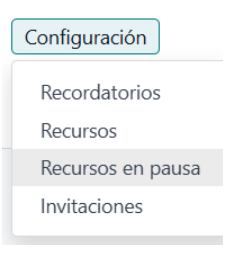
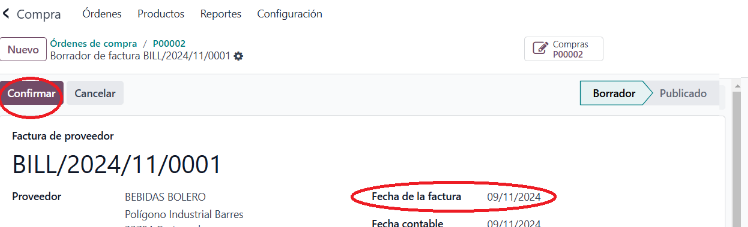
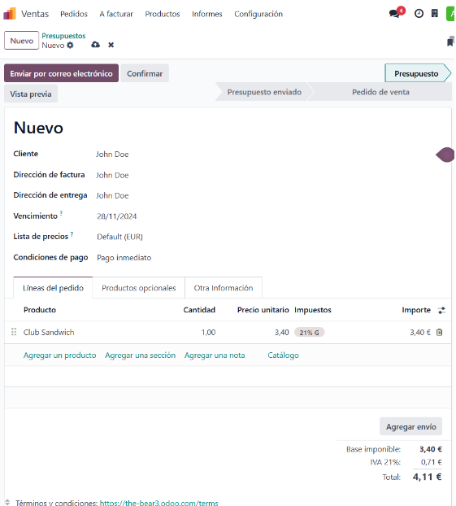
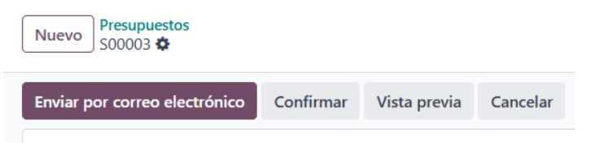
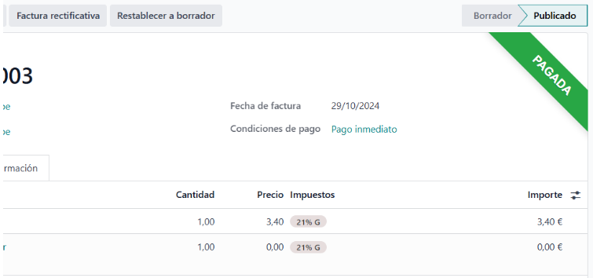
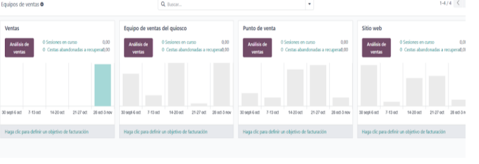
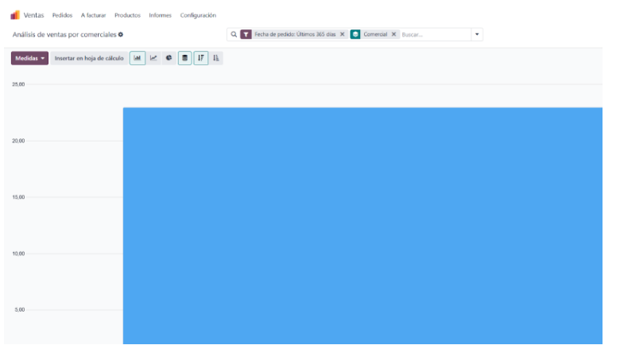

# INTRODUCCIÓ

Som una empresa consultora que ven els serveis d'Odoo a petites i mitjanes empreses.

### Introducció integrants del grup

1. Sóc Nerea, tinc 18 anys.  m'agrada molt l'informàtica especialment la programació. En aquest treball m'interessa explorar més sobre els sistemes ERP. Espero poder aprendre moltes coses.
2. Em dic Alba, tinc 22 anys i encara que mai havia estudiat res relacionat amb la informàtica, m'està agradant molt.

### Repartició de feines

- Nerea: Vendes i calendari (B)
- Alba: Compres i Costos (C)

**Comparació sistemes ERP**

| **Característica**                                        | **Abanq**                                                                                                                                                           | **Openbravo**                                                                                                                                                                                                                                                                                                                                                               |
|-----------------------------------------------------------|---------------------------------------------------------------------------------------------------------------------------------------------------------------------|-----------------------------------------------------------------------------------------------------------------------------------------------------------------------------------------------------------------------------------------------------------------------------------------------------------------------------------------------------------------------------|
| Sistema multiusuari                                       | Sí                                                                                                                                                                  | Sí                                                                                                                                                                                                                                                                                                                                                                          |
| Sistema de permisos                                       | Sí, amb diversos nivells per a cada característica                                                                                                                  | Sí, adaptable segons les funcions necessàries per als minoristes                                                                                                                                                                                                                                                                                                           |
| Interfície personalitzable                                | Sí, mitjançant temes                                                                                                                                                 | No especificat                                                                                                                                                                                                                                                                                                                                                             |
| Modularitat                                               | Sí, permet modular el codi                                                                                                                                           | Sí, sistema modular que permet seleccionar només els components necessaris, com la gestió d'inventaris, CRM i fidelització de clients                                                                                                                                                                                                                                      |
| Base de dades recomanada                                  | Principalment **PostgreSQL** (també compatible amb **MySQL** i **SQLite**, però es recomana PostgreSQL)                                                              | **PostgreSQL** o altres bases de dades segons necessitats                                                                                                                                                                                                                                                                                                                  |
| Desenvolupament                                           | Desenvolupat en **C++** i **toolkit Qt**                                                                                                                             | Plataforma de comerç unificat per a minoristes                                                                                                                                                                                                                                                                                                                             |
| Funcionalitats destacades                                 | - Sistema de permisos multiusuari - Personalització de la interfície - Modularitat del codi                                                                    | - Visió en temps real d'inventari i comportament de clients - Integració amb canals físics i digitals - Funcions d’omnicanalitat com **Click & Collect** i **Ship-from-Store**                                                                                                                                               |
| Funcions d’omnicanalitat                                  | No especificades                                                                                                                                                     | Sí: **Click & Collect**: les botigues físiques poden servir com a punts de recollida de comandes en línia **Ship-from-Store**: enviament de productes des de la botiga més propera, reduint temps i costos logístics                                                                                                         |
| Adaptabilitat segons necessitats de l'empresa             | No especificat                                                                                                                                                       | Sí, els minoristes poden adaptar la plataforma segons les seves necessitats actuals i futures, afegint funcionalitats segons l'evolució de l'empresa                                                                                                                                                                               |

### Punts Claus per a la Venda d’un ERP a un Client Potencial

Considerem que els punts claus a l'hora de vendre un ERP són els següents: 
- Aconseguir l'optimització dels processos.
- Millora de la visibilitat i presa de decisions de l'empresa del nostre client.
- Millora de l'experiència del client per tal de poder anticipar-nos a les seves necessitats.
- Possibilitat de personalització pel nostre client i escalabilitat.
- Adaptació a la normativa.

### Llicències que ofereix Odoo

| Llicència | Característiques | Empreses | Preu |
|-----------|-----------|-----------|-----------|
| Gratuïta  | Tot i ser gratuïta, aquesta llicència només ofereix funcionalitats bàsiques de l'ERP. No inclou moltes de les eines avançades ni actualitzacions.  | Empreses petites i proves.  | gratuït  |
| Estàndard  | Funcions més completes, suport i actualitzacions regulars, aplicacions i mòduls, com ara comptabilitat, gestió d'inventaris, CRM, projectes, màrqueting, vendes, etc.  | Empreses mitjanes que requereixen un ERP robust.  |11,90 €/usuari/mes |
| Personalitzada  | Personalització molt detallada, consultoria i suport especialitzat, desenvolupament de mòduls específics.  | Empreses grans o amb necessitats específiques.  | 17,90 €/usuari/mes

#  EL NOSTRE CLIENT: RESTAURANT THE BEAR

Els mòduls següents són els que hem oferit al nostre client amb una explicació detallada del funcionament de cadascú.
# Vendes

A l’apartat de **Vendes** gestionem les demandes en línia.

A vendes, tenim les seccions de **comandes de venda** i **pressupostos**, on es defineixen:

- **Client**
- **Direcció de facturació**
- **Direcció d’entrega**
- **Data de venciment**
- **Llista de preus** (si en tenim)
- **Condicions de pagament** (com pagament immediat o a un termini de dies)

Després, afegim els productes per fer el pressupost.

### Mètodes d’Enviament

Definim un **mètode d’enviament** especificant el mètode i el pes de l’ordre.

### Confirmació del Pressupost

Un cop creat el pressupost, el podem confirmar i enviar al client per correu electrònic.

### Creació de Factura

Després, crearem una **factura** a partir del pressupost. Podem escollir entre:

- Factura regular
- Factura anticipada per percentatge
- Factura anticipada per import fix

Quan la factura està creada, el client només ha de fer el pagament amb el mètode escollit. Si hi ha algun error a la factura, es pot fer una **factura rectificativa** indicant el motiu o crear-ne una de nova.

### Objectius de Facturació i Guanys

En aquest apartat, definim els **objectius de facturació** i les **guanys**. Podem visualitzar gràfics de vendes i el rendiment dels equips de vendes en quioscs, punts de venda, etc.

### Clients

Aquí trobem una llista de tots els **clients** que han fet alguna comanda.

### Facturació Pendent

A la **secció de facturació** es gestionen les factures pendents d’emetre.

### Productes

Aquest apartat mostra la **disponibilitat de productes** en el restaurant.

#### Variants de Producte

Podem crear variants de producte, definir el tipus (servei, bé o producte del restaurant) i especificar polítiques de facturació basades en quantitats sol·licitades o entregades. També es poden definir proveïdors i afegir vendes addicionals.

#### Reposició de Productes

Es pot reposar un producte, indicant la quantitat, la data programada i el proveïdor definit prèviament.

#### Llista de Productes

Podem organitzar una llista de productes per categories (entregues, despeses, etc.) i definir preus, descomptes o fórmules per a cada producte.

### Informes

Aquí es mostren **gràfics analítics** de vendes, per comercials i de productes i clients.

### Configuració

A **configuració**, es poden afegir mètodes de pagament i fer altres ajustaments al sistema.

# Calendari

La secció de **Calendari** permet programar cites, com reserves de taula, videotrucades, etc. Aquí es visualitza el calendari i es poden crear cites en hores específiques.

### Cites

Per a cada cita, podem triar el tipus de servei (reserva de taula, recurs, videotrucada), definir la durada, la finestra de disponibilitat, la data límit de cancel·lació i l’usuari o recurs assignat.

**Opcions addicionals:**

- Configurar correus de cancel·lació i confirmació
- Configurar pagaments per avançat
- Preferències alimentàries, si s’escau

### Compartició de Cites

Es pot compartir la cita per a qualsevol usuari, només per a nosaltres o per a usuaris i recursos específics.

### Reserves de Clients

Amb els paràmetres establerts, es poden registrar reserves de clients amb nom, assistents, data i durada.

### Modificació de l’Estat de la Cita

És possible modificar l’estat de la cita (reservat, cancel·lat, no mostrar).

### Dates de Tancament

Es poden afegir dates de tancament de recursos per motius especials.

### Programació

A **programació** visualitzem les reserves de recursos i de personal per cobrir els dies de treball.

#### Reserva de Recursos

#### Reserva de Personal

### Informes

A l’apartat d’**informes** es poden consultar anàlisis detallats sobre gestió de temps, cites i disponibilitat en el sistema. Aquests informes ajuden a monitoritzar la productivitat, amb filtres per durada i nombre de cites, i les dades es poden exportar a fulls de càlcul.

### Configuració

A configuració, es defineixen:

- Recordatoris per correu o SMS
- Recursos addicionals
- Estat de recursos (pausats i els seus motius)
- Invitacions per a propostes de cites

## COMPRES

El mòdul de compres és un dels mòduls que ofereix Odoo més importants per a gestionar l’adquisició de productes i serveis dins d’una empresa. Amb aquest mòdul, pots gestionar tot el procés de compres, des de la sol·licitud de compra fins a la recepció de productes i la facturació posterior.

### Sol·licitud de compra al proveïdor

Abans de fer una compra, has de demanar un pressupost al possible proveïdor al qual vols comprar-li. Això té com a avantatge poder saber el cost de determinat nombre de productes sense que hi hagi cap compromís amb l’empresa de fer finalment l’ordre.

Per fer això, es comença prement el botó superior esquerra que diu “Nou”.

La primera vegada caldrà registrar informació bàsica del proveïdor, com el nom, les dades de contacte, la direcció de facturació, etc. Si l’empresa és coneguda, és possible que ja es trobi registrada a la base de dades d’Odoo.

A més, Odoo et permet personalitzar certs aspectes a la configuració de compres:
- **Condicions de pagament**: Estableix com i quan pagaràs als proveïdors.
- **Magatzems**: Defineix els magatzems a què rebràs els productes comprats.

Un cop registrat el proveïdor, es pot començar a afegir els productes que interessa comprar.

Finalment, per enviar la sol·licitud s’ha de prémer el botó que diu “Enviar per correu electrònic” i posteriorment un altre que diu “Enviar”.

Posteriorment a això, el proveïdor contactarà de tornada i podrà rebutjar o acceptar la sol·licitud. En cas que l’accepti, es pot fer una última revisió dels productes, quantitats i preus. Llavors apareixerà una opció per convertir la “Sol·licitud de compra” a un “ordre de compra”.

### Ordres de compra

Quan la sol·licitud es converteix en una ordre de compra, implica que la sol·licitud passi a ser una comanda formal i que hi hagi un compromís amb el proveïdor.

### Recepció de productes

Un cop el proveïdor enviï els productes, s’hauran de rebre al magatzem. Caldrà seguir les següents passes:

1. Anar a Compra > Ordres de compra > seleccionar l’ordre de compra en concret > Rebre productes

2. Odoo et demana que registres la quantitat rebuda de cada producte. Si reps menys quantitat del que es demana, es pot ajustar la quantitat rebuda. Per finalitzar, prémer el botó “validar”.

3. Després de rebre els productes, Odoo actualitza automàticament l'inventari dels vostres magatzems amb les noves quantitats.

### Facturació al proveïdor

Un cop s’ha confirmat que els productes han arribat bé, cal fer la facturació. Ara a l’ordre de compra aniran apareixent una sèrie de botons nous. L'ordre és el següent:

Crear factura > Confirmar > Confirmar

Odoo generarà la factura basant-se en la recepció de productes.

Cal revisar els detalls de la factura (productes, quantitats, preus, etc.). És important afegir la data de la factura, ja que si no, no es podrà confirmar.

Si tot és correcte, es pot validar la factura. Això marcarà la factura com a pagada o pendent segons la condició de pagament definida.

### Informe i anàlisis

Odoo també ofereix diverses eines per analitzar i fer reports de les compres realitzades, cosa que és útil per a la presa de decisions: 

- **Informe de Compres:** Pots generar informes sobre les compres realitzades, com ara el total gastat amb un proveïdor, productes més comprats, entre d'altres. 
- **Analítica:** També permet fer anàlisis detallades sobre les compres per categoria, proveïdor, o fins i tot comparar compres de diferents períodes.

## Punt de Venda

En aquest mòdul es troben els aplicatius necessaris per a la gestió econòmica dels diferents punts de venda, des de la taula de productes i preus fins a la gestió de comandes de les taules i el cobrament posterior.

### Taulell Principal

El taulell principal ofereix el control d’obertura de la caixa registradora, incloent dades sobre el total de diners en data de tancament.

### Comandes

Permet dur a terme un control de les diverses comandes fetes in situ i del total d’aquestes, a més de gestionar els tipus de pagament emprats i la finestra de preparació per a la cuina. Això permet una Integració i sincronització amb altres mòduls:
- **Comptabilitat:** Sincronització automàtica de les vendes amb la comptabilitat.
- **Comandes en línia:** Si el negoci té un canal de venda en línia, les vendes es poden integrar amb el punt de venda físic per gestionar l’inventari conjuntament.

### Productes

A l’apartat de productes es troba el llistat actual de productes que ofereix el restaurant, amb la taula de preus i les diverses combinacions disponibles. Des d'aquesta opció es
pot modificar també els preus dels productes i afegir-ne un de nous.

#### Funcions Principals
- **Gestió de Productes:** Permet crear categories, definir preus, assignar codis de barres i establir variants de producte (com mida o color).
- **Actualització d’inventari en temps real:** Cada venda es reflecteix directament en el sistema d’inventari, facilitant el control d’estoc.

### Informes de Venda

Aquest mòdul permet visualitzar informes de venda per conèixer quins productes tenen més o menys demanda, optimitzant així la compra de productes.

- **Tipus d’informes:** El sistema genera informes diaris, setmanals o mensuals amb dades detallades sobre productes venuts, ingressos i rendiment per punt de venda o caixer.

### Configuració del Punt de Venda (POS) a Odoo

La configuració del sistema de vendes d’Odoo és fàcil d’usar i ideal per a comerços, hostaleria i negocis minoristes. Permet diverses opcions per adaptar-se a les necessitats específiques de cada negoci:

- **Pagaments:** Configura diferents formes de pagament (efectiu, targetes de crèdit, moneders electrònics, etc.), així com les condicions de crèdit.

- **Sessions de venda:** Cada punt de venda té una sessió que es tanca al final del dia per fer el balanç. Odoo gestiona de manera automàtica la conciliació.

- **Disseny del restaurant i les taules:** Personalització del disseny del restaurant per facilitar la gestió de les comandes.

## Costos

Els costos a Odoo es gestionen des del mòdul de "Despeses" (Gastos). Aquest mòdul és una eina molt útil per gestionar totes les despeses operatives d'una empresa. Permet als usuaris registrar, controlar, aprovar i reemborsar les despeses relacionades amb la feina, com els desplaçaments, les compres de materials o qualsevol altra despesa relacionada amb l'activitat empresarial.

### Taulell Principal

El taulell principal ofereix una vista general de totes les factures que es van introduint. Per començar, caldrà prémer el botó superior esquerre que diu “Nou”.

Un cop entrem, ens sortirà la següent pantalla. Cal anotar els diners que s’ha gastat, qui ha fet la despesa (si és una despesa d’empresa o d’un empleat) i clicant el botó que diu “Adjuntar rebut” et permet adjuntar una fotografia del rebut en concret.

A continuació, polsant el botó que diu “Crear report”, et demanarà que introdueixis el nom del gerent. Un cop introduït les dades, ja es pot enviar.

L’ordre seria el següent: **Crear report > Enviar al gerent > Aprovar > registrar asientos contables > Pagar**

Després s’introdueixen les dades necessàries, com per exemple el mètode de devolució (si en efectiu o per ingrés bancari) i es revisa que totes les altres dades siguin correctes abans de fer el pagament.

I finalment tenim el rebut pagat.

## Planificació

El mòdul de planificació d’Odoo és una eina dins de l'ERP que ajuda les empreses a gestionar i planificar les tasques i els recursos de manera eficient. És especialment útil per organitzar l'assignació de treball en equips, optimitzant la disponibilitat dels recursos i facilitant una planificació precisa de projectes, activitats i esdeveniments.

### Funcions Clau

- **Planificació i assignació de recursos:** Permet assignar recursos (com persones, equips o materials) a projectes o tasques específiques, facilitant la visualització de la càrrega de treball i assegurant que cada membre de l’equip sàpiga què ha de fer i quan.

- **Calendari:** Inclou una vista de calendari, que són molt útils per visualitzar fàcilment el calendari de tasques i la progressió de projectes en el temps.

- **Gestió de permisos i disponibilitat:** La planificació permet que els usuaris indiquin la seva disponibilitat, els permisos i altres horaris específics. Això ajuda els administradors a planificar les tasques en funció de les disponibilitats de l’equip, evitant conflictes i sobrecàrregues de treball.

- **Sincronització amb altres mòduls (RRHH):** Permet integrar el mòdul de planificació amb el de Recursos Humans per gestionar millor les assignacions de personal.

- **Anàlisi i informes:** El mòdul de Planificació d’Odoo inclou funcionalitats d’informes que permeten analitzar l'ús de recursos, la càrrega de treball i l’acompliment del personal en diferents projectes. Aquesta anàlisi ajuda a prendre decisions basades en dades i millora la planificació de futurs projectes.

[def]: c